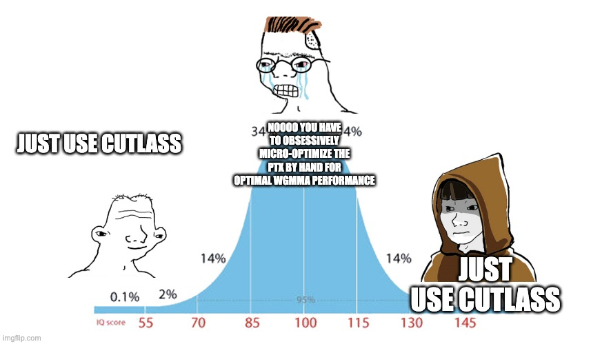

# Midwit Matmul



While the best, most comprehensive, highest performance way to execute matrix
multiplication on GPUs is probably to use Cutlass, or Triton, or
ThunderKittens, all of these libraries and tools are relatively complicated and
have a high barrier to understanding.

The goal of this repository is to provide a very minimalist implementation of
matrix multiplication primitives such that they are almost trivial to
understand.  It provides relatively small pieces of functionality, with limited
generality, so as to make the central cases obvious.

Furthermore, it binds this functionality to PyTorch operators so that it is easy
to play with layouts that would ordinarily require a big pile of obfuscated
div-mod math.

## Usage

To compile the library, use setup.py.  Note that this library only makes sense
on Hopper GPUs (H100, sm90a):
```bash
TORCH_CUDA_ARCH_LIST=9.0a+PTX python setup.py develop
```

To test the execution of a single wgmma opcode on one warpgroup, multiplying
64*16 x 16*256 matrices, run this:
```bash
python test.py
```

The register layout required by wgmma is quite complex.  To understand the layout, a simple PyTorch program is provided that reproduces the register layout for f16/bf16 by permuting a specially-created tensor whose values make row/column indices explicit:
```bash
python permute-output.py
```
